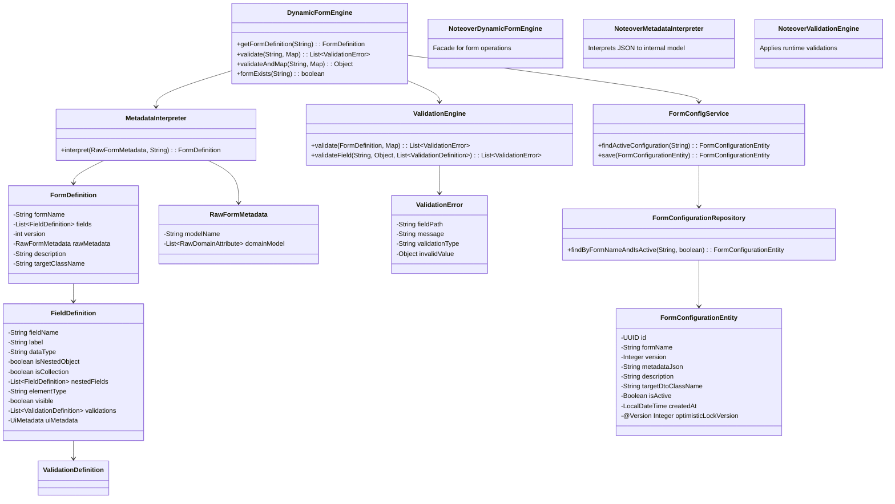
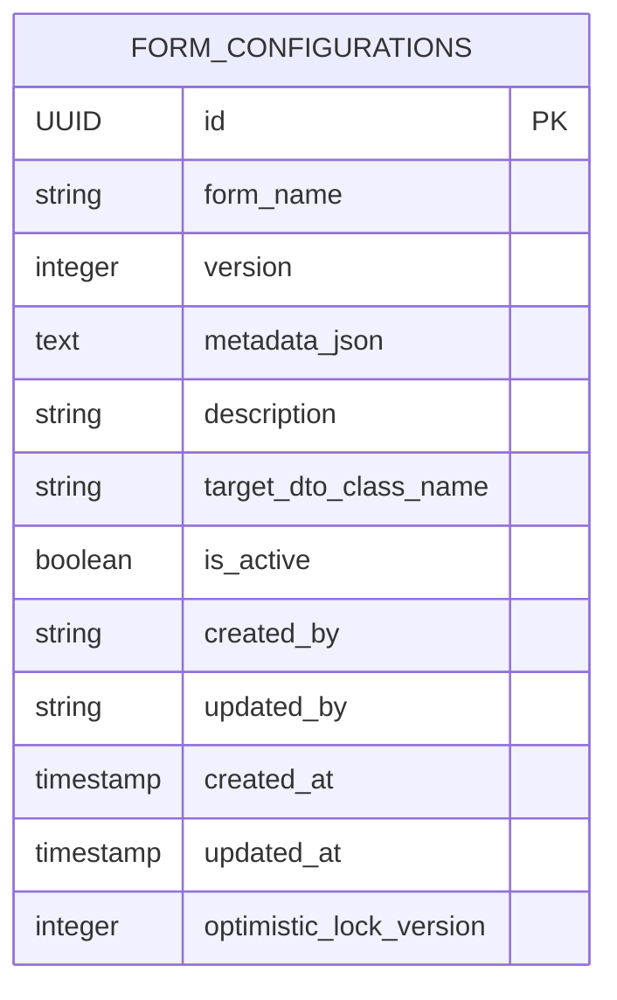

# Detailed Design Document: Dynamic Attribute Form Generator Engine

## Functional Requirements

### Reference to Use Cases / User Stories documented in Functional Prototype

The system supports the following primary use cases:
- **Form Definition Management**: Administrators can create, update, and version form configurations via JSON metadata without code changes.
- **Dynamic Form Rendering**: Frontend applications can retrieve form structures dynamically based on form name and version.
- **Form Data Submission**: Users can submit form data, which is validated against metadata rules and mapped to target DTOs.
- **Runtime Validation**: Submitted data is validated dynamically, supporting nested objects, collections, and complex validation rules.

Key user stories:
- As a developer, I want to define forms via configuration so I don't need to redeploy code.
- As a business analyst, I want to modify form fields and validations without technical knowledge.
- As a user, I want real-time validation feedback on form submissions.
- As a system integrator, I want type-safe DTO mapping for submitted data.

## Non-Functional Requirements

### Performance
- Form definitions cached to handle high-frequency requests (target: <10ms for cached forms).
- Validation processing linear with field count, optimized for up to 100 fields per form.
- Database queries use indexes for efficient metadata retrieval.

### Scalability
- Horizontal scaling supported via distributed cache (Redis) for form definitions.
- Stateless service design enables container orchestration (Kubernetes).
- Database connection pooling configured for high concurrency.

### Security
- Input validation prevents injection attacks.
- Admin APIs secured via Spring Security (recommended).
- Metadata JSON encrypted if containing sensitive information.
- Audit logging for configuration changes.

### Availability
- 99.9% uptime target with redundant database and cache layers.
- Graceful degradation: cached forms available during DB outages.
- Health checks and monitoring via Spring Boot Actuator.

## Architecture

### Reference to High-Level Architecture Diagram and the architecture component

The system follows a layered architecture with clean separation of concerns:

**Presentation Layer**: REST controllers handle HTTP requests/responses.
**Service Layer**: Business logic for form processing, validation, and metadata interpretation.
**Persistence Layer**: JPA entities and repositories for data access.
**DTO Layer**: Data transfer objects for API contracts and internal processing.

Key components:
- DynamicFormEngine: Core orchestrator
- MetadataInterpreter: JSON to internal model converter
- ValidationEngine: Runtime validation processor
- FormConfigurationRepository: Data persistence
- Cache layer for performance

High-level flow:
```
Client Request → Controller → Service → Validation → DTO Mapping → Response
```

## Design

### Design Considerations and Approach
- **Metadata-Driven**: All form logic derived from JSON configuration for flexibility.
- **Type Safety**: Runtime DTO mapping ensures compile-time safety for target objects.
- **Extensibility**: Pluggable validation rules and UI component types.
- **Versioning**: Form configurations versioned with optimistic locking.
- **Caching**: In-memory caching with eviction on updates.

### High-Level Design (Including Component Diagram and Logical flow)

```mermaid
graph TD
    subgraph "Presentation Layer"
        A[Client] --> B[FormRenderController]
        A --> L[FormConfigController]
        B --> M[GlobalExceptionHandler]
        L --> M
    end
    subgraph "Service Layer"
        B --> C[DynamicFormEngine]
        C --> D[MetadataInterpreter]
        C --> E[ValidationEngine]
        C --> F[FormConfigService]
        L --> F
    end
    subgraph "Persistence Layer"
        F --> G[FormConfigurationRepository]
        G --> H[(Database)]
    end
    subgraph "Infrastructure"
        C --> I[Spring Cache]
        D --> J[Jackson ObjectMapper]
        E --> K[Validation Rules Enum]
        G --> N[Hibernate/JPA]
        H --> O[Flyway Migrations]
    end
    subgraph "DTO Layer"
        P[FormDefinition DTO] --> C
        Q[ValidationError DTO] --> E
        R[RawFormMetadata DTO] --> D
    end
    D --> P
    E --> Q
    J --> R
    I -.->|Cache Hit| C
    C -.->|Cache Miss| G
    Note over A,M: REST API endpoints with JSON request/response
    Note over I: ConcurrentMapCacheManager (upgradeable to Redis)
    Note over H: H2/PostgreSQL with connection pooling

### Design Patterns
- **Facade Pattern**: DynamicFormEngine provides unified interface.
- **Interpreter Pattern**: MetadataInterpreter processes JSON grammar.
- **Strategy Pattern**: ValidationEngine applies different validation strategies.
- **Repository Pattern**: Data access abstraction.
- **DTO Pattern**: Data transfer objects for layer separation.

### Class Diagram, Sequence Diagrams, Data Flow Diagrams (if applicable)

#### Sequence Diagram: Form Submission Flow
```mermaid
sequenceDiagram
    participant Client
    participant FormRenderController
    participant DynamicFormEngine
    participant Cache
    participant FormConfigService
    participant Repository
    participant Database
    participant MetadataInterpreter
    participant ValidationEngine
    participant ObjectMapper
    participant GlobalExceptionHandler

    Client->>FormRenderController: POST /api/forms/{formName}/submit (JSON data)
    FormRenderController->>DynamicFormEngine: validateAndMap(formName, data)
    DynamicFormEngine->>Cache: checkCache(formName)
    alt Cache Hit
        Cache-->>DynamicFormEngine: FormDefinition (cached)
    else Cache Miss
        DynamicFormEngine->>FormConfigService: findActiveConfiguration(formName)
        FormConfigService->>Repository: findByFormNameAndIsActive(formName, true)
        Repository->>Database: SELECT * FROM form_configurations
        Database-->>Repository: ResultSet
        Repository-->>FormConfigService: FormConfigurationEntity
        FormConfigService-->>DynamicFormEngine: FormConfigurationEntity
        DynamicFormEngine->>MetadataInterpreter: interpret(rawMetadata, formName, version)
        MetadataInterpreter->>ObjectMapper: readValue(metadataJson, RawFormMetadata.class)
        ObjectMapper-->>MetadataInterpreter: RawFormMetadata
        MetadataInterpreter->>MetadataInterpreter: buildFieldDefinitions()
        MetadataInterpreter-->>DynamicFormEngine: FormDefinition
        DynamicFormEngine->>Cache: put(formName, FormDefinition)
    end
    DynamicFormEngine->>ValidationEngine: validate(formDefinition, data)
    ValidationEngine->>ValidationEngine: validateFieldRecursive("", data, field, errors)
    loop For each field
        ValidationEngine->>ValidationEngine: applyValidation(field, value, validation)
        alt Validation Fails
            ValidationEngine-->>ValidationEngine: add ValidationError
        end
    end
    ValidationEngine-->>DynamicFormEngine: List<ValidationError>
    alt Has Errors
        DynamicFormEngine-->>DynamicFormEngine: throw DynamicValidationException(errors)
        DynamicFormEngine-->>FormRenderController: DynamicValidationException
        FormRenderController->>GlobalExceptionHandler: handleException()
        GlobalExceptionHandler-->>Client: 400 Bad Request (JSON error array)
    else No Errors
        DynamicFormEngine->>DynamicFormEngine: getTargetClassName()
        DynamicFormEngine->>DynamicFormEngine: Class.forName(targetClassName)
        DynamicFormEngine->>ObjectMapper: convertValue(data, targetClass)
        ObjectMapper-->>DynamicFormEngine: mapped DTO instance
        DynamicFormEngine-->>FormRenderController: DTO
        FormRenderController-->>Client: 200 OK (success response)
    end
```

#### Class Diagram


#### Data Flow Diagram
```mermaid
flowchart TD
    A[JSON Metadata from DB] --> B[MetadataInterpreter]
    B --> C[FormDefinition with FieldDefinitions]
    D[User Input JSON] --> E[ValidationEngine]
    C --> E
    E --> F{Validation Check}
    F -->|Pass| G[ObjectMapper]
    F -->|Fail| H[Collect ValidationErrors]
    G --> I[Target DTO Instance]
    I --> J[Business Service Layer]
    H --> K[GlobalExceptionHandler]
    K --> L[JSON Error Response to Client]
    J --> M[Success Response to Client]
    Note over A: Stored in form_configurations.metadata_json
    Note over D: Parsed from HTTP request body
    Note over I: Mapped to fully qualified class name
    Note over F: Recursive validation for nested objects/collections

### Integration Points (internal & external)
- **Internal**: Spring components communicate via dependency injection.
- **External**: REST APIs for frontend integration, database for persistence, cache for performance.
- **Third-party**: Jackson for JSON processing, Hibernate for ORM.

## API Design

### API Endpoints (REST/gRPC/etc.)
All APIs are RESTful using HTTP methods:

```
GET    /api/forms/{formName}           - Get form definition
POST   /api/forms/{formName}/submit   - Submit form data
POST   /api/forms/{formName}/validate - Validate without submission
GET    /api/forms/{formName}/exists   - Check form existence
POST   /api/config/forms              - Create/update configuration
GET    /api/config/forms/{formName}   - Retrieve configuration
GET    /api/config/forms              - List all configurations
DELETE /api/config/forms/{formName}   - Delete configuration
```

### Request/Response Schemas
**Get Form Definition Response**:
```json
{
  "formName": "string",
  "description": "string",
  "version": "integer",
  "targetClassName": "string",
  "fields": [
    {
      "fieldName": "string",
      "label": "string",
      "dataType": "string",
      "isNestedObject": "boolean",
      "isCollection": "boolean",
      "visible": "boolean",
      "validations": [
        {
          "type": "REQUIRED|REGEX|MIN|MAX|DATE_FORMAT|ALLOW_FUTURE|ALLOW_PAST",
          "parameters": "object",
          "message": "string"
        }
      ],
      "uiMetadata": {
        "label": "string",
        "componentType": "string",
        "required": "boolean"
      }
    }
  ]
}
```

**Submit Form Request**:
```json
{
  "firstName": "string",
  "individual": {
    "dateOfBirth": "string"
  },
  "addresses": [
    {
      "postalCode": "string"
    }
  ]
}
```

### Error Handling
All errors return JSON arrays of validation errors:
```json
[
  {
    "fieldPath": "string",
    "message": "string",
    "validationType": "string",
    "invalidValue": "any"
  }
]
```

HTTP status codes:
- 200: Success
- 400: Validation errors
- 404: Form not found
- 500: Server error

## Data Model

### Entity Relationship Diagram (ERD)


### Database Schema
```sql
CREATE TABLE form_configurations (
    id UUID PRIMARY KEY DEFAULT gen_random_uuid(),
    form_name VARCHAR(255) NOT NULL,
    version INTEGER NOT NULL DEFAULT 1,
    metadata_json TEXT NOT NULL,
    description VARCHAR(1000),
    target_dto_class_name VARCHAR(500),
    is_active BOOLEAN NOT NULL DEFAULT true,
    created_by VARCHAR(100),
    updated_by VARCHAR(100),
    created_at TIMESTAMP NOT NULL DEFAULT CURRENT_TIMESTAMP,
    updated_at TIMESTAMP,
    optimistic_lock_version INTEGER NOT NULL DEFAULT 0,
    UNIQUE(form_name, version)
);

CREATE INDEX idx_form_name_active ON form_configurations(form_name, is_active);
```

## Technology Stack

### Frameworks, Libraries & Tools
- **Framework**: Spring Boot 4.0.3
- **Language**: Java 21
- **Build Tool**: Gradle
- **Database**: H2 (dev), PostgreSQL (prod)
- **ORM**: Hibernate/JPA
- **JSON Processing**: Jackson
- **Caching**: Spring Cache
- **Migration**: Flyway
- **Testing**: JUnit 5, Mockito, Testcontainers
- **Documentation**: Spring REST Docs
- **Monitoring**: Spring Boot Actuator
- **Container**: Docker (for deployment)</content>
<parameter name="filePath">/home/ashim/Office/dynamic-attribute-generator/docs/DetailedDesign.md