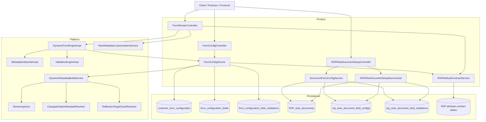
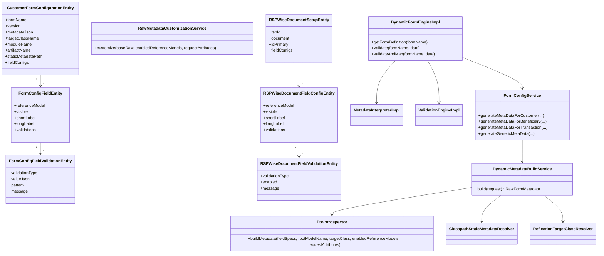
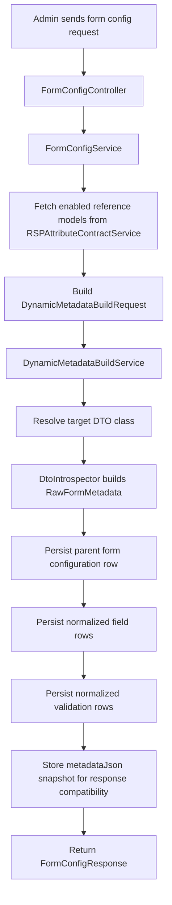
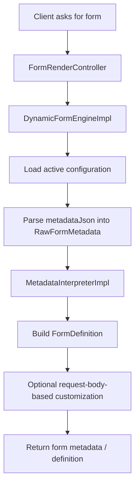
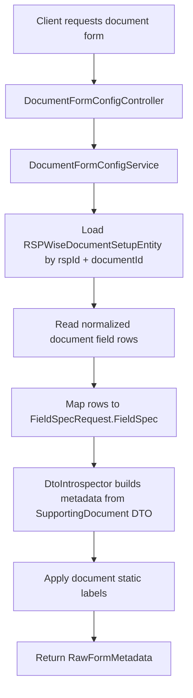
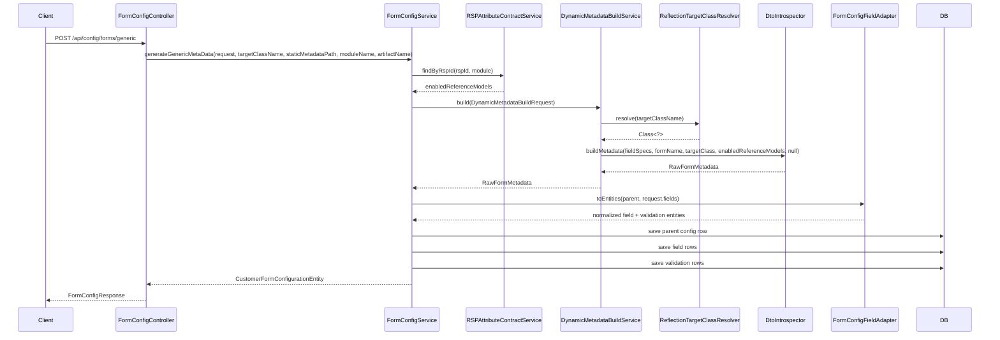
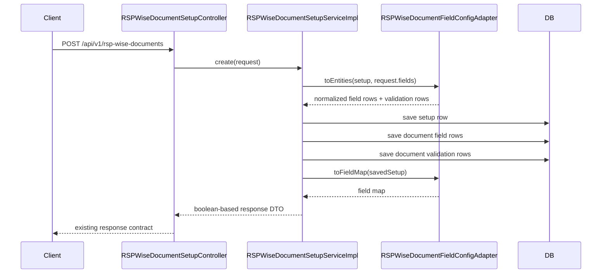

# V4 Architecture: Platform and Product Split

## 1. Purpose

This document describes the current `v4` architecture of the dynamic attribute generator after the platform refactor and persistence normalization work.

The main goals of the design are:

- keep API response contracts stable while allowing internal refactors
- separate reusable `platform` logic from `product`-specific orchestration
- support dynamic form generation from:
  - `targetDto`
  - `static metadata json`
  - request body field specs
- normalize persistence for configuration details instead of storing behavior only in JSON blobs
- make future modules reusable without adding more customer/beneficiary/transaction-only branches

## 2. High-Level View

The codebase is now split into two clear responsibility zones:

- `platform`
  - generic dynamic-form engine
  - DTO introspection
  - metadata interpretation
  - metadata customization
  - static metadata lookup
  - target DTO resolution
  - validation execution
- `product`
  - endpoint contracts
  - customer/beneficiary/transaction/document use cases
  - RSP-specific business rules
  - form config persistence
  - RSP-wise document setup persistence
  - request/response compatibility

## 3. Platform vs Product Responsibilities

### 3.1 Platform Responsibilities

The `platform` package provides reusable building blocks that are independent of customer or remittance business flows.

Key classes:

- [`DynamicFormEngineImpl.java`](/home/ashim/Office/dynamic-attribute-generator/src/main/java/com/example/dynamicform/platform/engine/DynamicFormEngineImpl.java)
- [`DtoIntrospector.java`](/home/ashim/Office/dynamic-attribute-generator/src/main/java/com/example/dynamicform/platform/interpreter/DtoIntrospector.java)
- [`MetadataInterpreterImpl.java`](/home/ashim/Office/dynamic-attribute-generator/src/main/java/com/example/dynamicform/platform/interpreter/MetadataInterpreterImpl.java)
- [`ValidationEngineImpl.java`](/home/ashim/Office/dynamic-attribute-generator/src/main/java/com/example/dynamicform/platform/validation/ValidationEngineImpl.java)
- [`DynamicMetadataBuildService.java`](/home/ashim/Office/dynamic-attribute-generator/src/main/java/com/example/dynamicform/platform/service/DynamicMetadataBuildService.java)
- [`RawMetadataCustomizationService.java`](/home/ashim/Office/dynamic-attribute-generator/src/main/java/com/example/dynamicform/platform/service/RawMetadataCustomizationService.java)
- [`ClasspathStaticMetadataResolver.java`](/home/ashim/Office/dynamic-attribute-generator/src/main/java/com/example/dynamicform/platform/metadata/ClasspathStaticMetadataResolver.java)
- [`ReflectionTargetClassResolver.java`](/home/ashim/Office/dynamic-attribute-generator/src/main/java/com/example/dynamicform/platform/resolver/ReflectionTargetClassResolver.java)

Platform is responsible for:

- building metadata from arbitrary DTO classes and field specs
- preserving request-driven `visible`, `shortLabel`, `longLabel`, and validations
- interpreting raw metadata into renderable form definitions
- validating payloads against interpreted validation rules
- mapping payloads to the configured target DTO
- customizing raw metadata using request-body paths

Platform does not know customer, beneficiary, transaction, or document semantics.

### 3.2 Product Responsibilities

The `product` package owns business-specific decisions and persistence.

Key classes:

- [`FormConfigService.java`](/home/ashim/Office/dynamic-attribute-generator/src/main/java/com/example/dynamicform/product/service/FormConfigService.java)
- [`RSPAttributeContractService.java`](/home/ashim/Office/dynamic-attribute-generator/src/main/java/com/example/dynamicform/product/service/RSPAttributeContractService.java)
- [`RSPWiseDocumentSetupServiceImpl.java`](/home/ashim/Office/dynamic-attribute-generator/src/main/java/com/example/dynamicform/product/service/RSPWiseDocumentSetupServiceImpl.java)
- [`DocumentFormConfigService.java`](/home/ashim/Office/dynamic-attribute-generator/src/main/java/com/example/dynamicform/product/service/DocumentFormConfigService.java)
- [`FormConfigController.java`](/home/ashim/Office/dynamic-attribute-generator/src/main/java/com/example/dynamicform/product/controller/FormConfigController.java)
- [`FormRenderController.java`](/home/ashim/Office/dynamic-attribute-generator/src/main/java/com/example/dynamicform/product/controller/FormRenderController.java)

Product is responsible for:

- selecting module-specific static metadata files
- selecting target DTO classes for built-in modules
- collecting enabled reference models from RSP contracts
- enriching forms with RSP document-count constraints
- persisting normalized configuration rows
- preserving legacy response shapes while changing internal persistence

## 4. Architecture Diagram

## 5. Design Diagram

## 6. Persistence Design

## 6.1 Form Config Persistence

The old design stored behavior almost entirely in `metadataJson`.

The new design keeps `metadataJson` for stable response compatibility, but normalizes request-driven configuration into child tables.

### Parent Table

`CustomerFormConfigurationEntity`

Stores:

- form identity
- version
- active flag
- rspId
- description
- target class name
- static metadata path
- module/artifact name
- metadata snapshot JSON

### Child Table

`FormConfigFieldEntity`

Stores one row per field spec:

- `referenceModel`
- `displayOrder`
- `visible`
- `shortLabel`
- `longLabel`

### Grandchild Table

`FormConfigFieldValidationEntity`

Stores one row per validation rule:

- `validationType`
- `valueJson`
- `pattern`
- `message`

This allows:

- queryable form config data
- future analytics / auditing
- partial migrations away from metadata-only persistence
- cleaner schema evolution if more validation attributes are added

## 6.2 RSP Wise Document Persistence

The old document setup design mixed:

- boolean flag columns
- freeform metadata JSON

The new design keeps the parent table and adds normalized child rows.

### Parent Table

`RSPWiseDocumentSetupEntity`

Stores:

- `rspId`
- `documentId`
- `isPrimary`

### Child Table

`RSPWiseDocumentFieldConfigEntity`

Stores:

- `referenceModel`
- `displayOrder`
- `visible`
- `shortLabel`
- `longLabel`

### Grandchild Table

`RSPWiseDocumentFieldValidationEntity`

Stores:

- normalized validation rows
- currently `REQUIRED` as an enum-based validation type
- required enabled flag and message

Legacy boolean columns and `metadataJson` remain as fallback during rollout.

## 7. Main Flows

## 7.1 Flow Diagram: Create or Update Form Config

## 7.2 Flow Diagram: Render Dynamic Form

## 7.3 Flow Diagram: Generate Document Form

## 8. Sequence Diagram: Generic Form Configuration Creation

## 9. Sequence Diagram: Document Setup Create and Response Compatibility

## 10. Enterprise Design Choices

The architecture follows patterns commonly used in larger systems:

- Facade pattern
  - `DynamicFormEngineImpl` gives one runtime entry point for loading, validating, and mapping forms
- Strategy-like modularization
  - metadata resolution, DTO resolution, metadata customization, and validation are independent services
- Adapter pattern
  - `FormConfigFieldAdapter`
  - `RSPWiseDocumentFieldConfigAdapter`
  - these isolate row-model persistence from API contracts
- Aggregate root design
  - `CustomerFormConfigurationEntity` is the aggregate root for form field rows and validation rows
  - `RSPWiseDocumentSetupEntity` is the aggregate root for document field rows and validation rows
- Backward-compatible snapshotting
  - `metadataJson` remains persisted so response contracts and existing flows stay stable while internal storage evolves

## 11. Current Constraints and Future Improvements

### Current Constraints

- JPA schema management still relies on `ddl-auto: update`
- there is no formal Flyway/Liquibase migration yet
- some legacy columns remain for backward-compatible rollout

### Recommended Next Improvements

1. Add Flyway or Liquibase migrations and convert legacy fallback fields into one-time migration scripts.
2. Add explicit query services that rebuild metadata from normalized rows instead of relying on snapshot JSON.
3. Expand normalized validation support with typed columns or a richer validation parameter model if rule diversity grows.
4. Add integration tests for:
   - generic form config creation
   - normalized document setup persistence
   - response-shape compatibility
   - DTO/static-json onboarding for a new module

## 12. Summary

The system is now structured so that:

- `platform` provides generic dynamic form capabilities
- `product` provides business-specific composition and persistence
- form config and document config both use normalized persistence models
- API outputs remain compatible
- new modules can be onboarded by supplying:
  - a target DTO
  - a static metadata JSON
  - a proper request body

That is the core architectural outcome of the `v4` refactor.
